# 04 · The imaging engine

`app/imaging/` turns an accepted image into what the tile server serves and what the interface shows. The
processing worker calls it for uploads; the base-collection scripts call it for imported slides. Every
function writes only where it is told to.

| Module | Role |
|---|---|
| `library.py` | Loads libvips (with OpenSlide) the same way on every machine. |
| `reader.py` | Describes any accepted file from its headers: levels, pixel size, associated images, focal planes, slide geometry. |
| `guards.py` | The dimension limits, applied before any pixel is decoded. |
| `pyramid.py` | One pyramidal BigTIFF per plane, with its level-0 fidelity measured. |
| `zstack.py` | Which planes of a focal stack are kept. |
| `complex_wavelet.py` | The complex wavelet transform of the EPFL extended-depth-of-field plugin. |
| `edf.py` | Extended depth of field: variance selection and complex wavelet fusion, in tiles. |
| `derivatives.py` | Thumbnails, the scan placed on the macro photograph, the true-scale mount. |

## 1. Reading a file

libvips (Martinez and Cupitt, 2005) reads scanner formats through OpenSlide (Goode et al., 2013) and
everything else through its own loaders. The reader normalises both into one description, from headers only:

- **Levels.** The resolution levels the file already carries (CMU-1: 46000, 11500 and 2875 px wide).
- **Pixel size**, in micrometres, from one of three sources, in this order: the vendor (`openslide.mpp-x`);
  ImageJ metadata when its unit is the micron; TIFF resolution tags when their unit is set and the value is in
  the microscopy range, at least 100 px/mm (at most 10 um/px). A camera's or a screen's nominal density (72,
  96, 300 dpi, or the 6400 dpi in the thin section's JPEG header) is not a calibration and is ignored.
- **Associated images**: the label, macro and thumbnail photographs a scanner stores beside the slide. The
  slide object shows the real label and the real glass instead of a drawn one.
- **Focal planes.** One for a flat image. For a Hamamatsu z-stack, every level-0 page, ordered by its
  `ZOffsetFromSlideCentre` tag (nanometres). For a multi-page TIFF whose pages share one size (an ImageJ
  stack), every page, with its depth from the ImageJ `spacing` when the unit is the micron.
- **Slide geometry** (Hamamatsu): the slide's physical size and the scanned region's centre as an offset from
  the slide centre.

| Hamamatsu tag | Meaning | Ostracod A |
|---|---|---|
| 65424 | z offset of the plane from the slide centre, nm | -70,000 to 70,000 in steps of 2,000 (71 planes) |
| 65422, 65423 | x, y offset of the scan centre from the slide centre, nm | 3,226,800 and 841,800 |
| 65496, 65497 | slide width and height, nm | 76,000,000 and 26,000,000 |

What the reader returns for each fixture, equal to the files' own metadata (gate R-010):

| File | Reader | Size, px | Levels | um/px | Associated | Planes |
|---|---|---|---|---|---|---|
| CMU-1 (Aperio SVS, CC0) | OpenSlide | 46000 x 32914 | 3 | 0.499 (vendor) | label, macro, thumbnail | 1 |
| Ostracod A (Hamamatsu NDPI, CC BY 4.0) | OpenSlide + TIFF tags | 3840 x 4608 | 7 | 0.2289 (vendor) | macro | 71, -70 to 70 um |
| NHM louse scan (TIFF) | libvips TIFF | 7369 x 3377 | 1 | none (96 dpi is a screen default) | none | 1 |
| Commons thin section, XPL (JPEG) | libvips JPEG | 4010 x 2100 | 1 | none | none | 1 |
| EPFL "dome" stack (ImageJ TIFF) | libvips TIFF | 499 x 363 | 1 | none (75 dpi) | none | 20 |

OpenSlide sees only one focal plane of an NDPI; the other 70 are TIFF pages that libvips reads directly
(`tiffload(page=...)`, about 0.2 s per plane).

## 2. Limits

A decompression bomb is a small file that expands to an image far larger than the machine can hold. The header
dimensions are checked before anything is decoded: at most 200,000 px on a side and 20 gigapixels in a plane
(the ingestion contract's ranges). The test builds a 60-byte TIFF whose header claims 150,000 x 150,000 px
and one byte of data; it is refused from the header, which proves no decoding happened (R-017).

## 3. One pyramid per plane

Each plane is written as one tiled, pyramidal BigTIFF: 512 px tiles, level 0 and every half-size level below
it until the image fits one tile, so a plane of long side $n$ has

$$L = \left\lceil \log_2 \frac{n}{512} \right\rceil + 1$$

levels (R-011). One file per plane instead of thousands of tile files: for CMU-1 the storage research
measured 169.1 MB in one file against 171.4 MB in 7,879 static tiles (dossier 04).

**Fidelity is measured, not assumed.** 32 regions of 512 x 512 px, placed by a seeded generator, are read from
the source and from level 0 of the written file:

$$\mathrm{PSNR} = 10 \log_{10} \frac{255^2}{\mathrm{MSE}}, \qquad
\mathrm{MSE} = \frac{1}{N}\sum_i (x_i - y_i)^2 ,$$

and the mean over the regions must reach 38 dB (R-012). JPEG at quality 85 is the default. At that quality
libvips subsamples chroma (4:2:0), which is transparent for most specimens but not for a thin section under
crossed polars, whose interference colours are dense chroma detail and are the diagnostic content:

| Commons thin section, XPL | Q85 | Q88 | Q90 | Q92 | Q95 | Q97 |
|---|---|---|---|---|---|---|
| File, MB | 3.17 | 3.54 | 9.23 | 9.87 | 12.29 | 14.28 |
| Level-0 PSNR, dB | 32.1 | 32.9 | 49.9 | 50.5 | 52.2 | 53.4 |

The jump between 88 and 90 is libvips turning chroma subsampling off from quality 90. The writer therefore
measures every plane and, when quality 85 falls short, writes it again at quality 90. Measured on the fixtures:

| Fixture | Chosen | KB/MP | PSNR, dB |
|---|---|---|---|
| CMU-1, 30 MP region | JPEG Q85 | 56 | 53.6 |
| NHM louse scan | JPEG Q85 | 57 | 44.0 |
| Commons thin section | JPEG Q90 (Q85 gave 32.1 dB) | 1,100 | 49.9 |

**WebP** at quality 80 is written only when asked and kept only when its file is smaller than the JPEG file
and it also reaches 38 dB (R-202): 31.6 against 56 KB/MP on CMU-1, 13.4 against 57 on the louse scan, but
larger than JPEG on the thin section and below the floor there (414 against 376 KB/MP at 32.6 dB; the storage
research found the same: 417 against 379 KB/MP).

**Resolution tags.** With a known pixel size $p$ (um), the tags carry $10^4 / p$ pixels per centimetre, unit
centimetre, so any TIFF viewer shows the right scale. Without one, libvips would copy the source's nominal
density; the writer sets the resolution unit to none instead (R-013). Metadata other than the ICC profile is
not copied.

## 4. Which focal planes are kept

A stack's full pyramid set is estimated as the plane count times one plane's measured pyramid. At most 500 MB,
the whole stack is kept (ostracod A: 71 planes of 17.7 MP). Above it, $k = 11$ planes are kept, at indices

$$i_j = \operatorname{round}\!\left( j \, \frac{n - 1}{k - 1} \right), \qquad j = 0, \ldots, k-1,$$

which include both ends and are strictly increasing when $n \ge k$. Each kept plane keeps its original index
and depth, so the viewer labels real focal depths (R-014).

## 5. Extended depth of field

A focal stack shows each part of a specimen sharp in a different plane. Extended depth of field builds one
image sharp everywhere, and a height map: for every pixel, the plane it came from, which with the planes'
depths is a depth map of the specimen's surface. Both methods follow the EPFL plugin (Forster, Van De Ville,
Berent, Sage and Unser, 2004), whose Java source was read for every step, and are checked against the plugin's
own output, produced once with its unmodified jar on its three sample stacks (a colony dome, 499 x 363 px,
20 planes, RGB; a fly eye, 680 x 500 px, 32 planes, 32-bit grey; a skeleton, 170 x 116 px, 3 planes, RGB).

Colour stacks are fused on their luminance, $Y = \lfloor 0.299 R + 0.587 G + 0.114 B \rfloor$ (truncated as the
plugin does); the colour composite takes each pixel from the plane the height map names.

### Variance selection

The sharpness of plane $k$ at pixel $p$ is its local variance in the 5 x 5 window $N(p)$, with mirror
boundaries:

$$\sigma_k^2(p) = \sum_{q \in N(p)} \big(I_k(q) - \mu_k(p)\big)^2, \qquad
\mu_k(p) = \frac{1}{25} \sum_{q \in N(p)} I_k(q), \qquad h(p) = \arg\max_k \sigma_k^2(p).$$

Computed in single precision in the plugin's summation order, ties keeping the earlier plane.

### Complex wavelet fusion

**The transform.** Two real filter banks, a "real" one $(h, g)$ and an "imaginary" one $(\tilde h, \tilde g)$,
each a lowpass and a highpass of length $L$ (6, 14 or 22; the plugin's "high" preset uses 14). One analysis
step along an axis of length $N$ keeps the even samples of the periodic correlation:

$$y[i] = \sum_{k=0}^{L-1} f[k] \; x\big[(2i + k - L/2) \bmod N\big],$$

lowpass half first, highpass half second. Writing $S_{ab}$ for rows filtered with bank $a$ and columns with bank
$b$ ($r$ real, $i$ imaginary), the first scale of an image $x$ is

$$\operatorname{Re} W = S_{rr} x - S_{ii} x, \qquad \operatorname{Im} W = S_{ri} x + S_{ir} x ,$$

and every further scale transforms the complex lowpass quadrant $u + \mathrm{i} v$:

$$\operatorname{Re} W' = S_{rr}u - S_{ii}u - S_{ri}v - S_{ir}v, \qquad
\operatorname{Im} W' = S_{ri}u + S_{ir}u + S_{rr}v - S_{ii}v .$$

Synthesis is the exact inverse (reconstruction error below $10^{-6}$ on 0 to 255 data). Checked against the
plugin's own `ComplexWavelet.analysis` and `synthesis`: coefficients equal within $3 \times 10^{-13}$.

**The fusion.** Sizes that are not powers of two are padded, centred, with zeros to the plugin's size (499
becomes 512, 680 becomes 1024) and cropped back; the scale count is the most the size allows.

1. At every coefficient position the plane of greatest modulus wins: $k^*(p) = \arg\max_k |W_k(p)|^2$.
2. *Sub-band consistency*, on the three finest scales: for the three detail coefficients of one position, when
   two agree on a plane the third follows them; when all three differ, the plane of the largest modulus wins
   in all three.
3. *Majority consistency*, on each detail sub-band of the three finest scales: a position takes the plane held
   by more than half of its 5 x 5 neighbourhood, if one is.
4. The inverse transform of the chosen coefficients is a composite $\hat I$.
5. *Reassignment*: every pixel takes the stack value nearest to it, $h(p) = \arg\min_k |I_k(p) - \hat I(p)|$, so
   the result holds only measured pixels.

**The port is exact** (R-204). Run with the plugin's conventions, the height maps equal the plugin's on 100
percent of pixels on all three stacks, for both methods, and the composites have SSIM 1.000.

### A defect in the plugin, and what is shipped instead

Both consistency checks in the plugin take the image height as the x extent (`nx = coeffRe.getHeight()` in
`EdfComplexWavelets.subBandConsistencyCheck`, `nx = map.getHeight()` in `EdfWaveletMaximumModulus.majCCSubBand`).
On a square padded size that changes nothing. On a non-square one (the eye pads to 1024 x 512, the skeleton to
256 x 128) the checks visit regions that are not the sub-bands. Laminario uses the true geometry by default and
keeps the plugin's as an option (`plugin_axes=True`), which is how the port is proven exact.

Which is right was measured on synthetic stacks whose in-focus plane is known at every pixel: a multi-scale
texture on a tilted surface with a bump, each plane blurred by a Gaussian that widens with the distance to the
surface (`tests/imaging/synthetic.py`). Share of pixels within one plane of the truth, and the composite's
root-mean-square error against the sharp texture (grey levels), without noise:

| Size | Planes | Variance | Wavelet, plugin axes | Wavelet, true axes |
|---|---|---|---|---|
| 256 x 128 | 12 | 0.999, 0.34 | 0.268, 8.60 | 0.773, 1.80 |
| 300 x 170 | 16 | 0.999, 0.37 | 0.212, 9.25 | 0.715, 1.48 |
| 256 x 256 | 16 | 0.999, 0.33 | 0.726, 1.96 | 0.726, 1.96 |
| 700 x 420 | 20 | 0.999, 0.32 | 0.220, 8.64 | 0.734, 1.02 |
| 680 x 500 | 24 | 0.999, 0.34 | 0.233, 8.51 | 0.707, 1.48 |

The plugin's convention is three times less often right on every non-square size and identical on the square
one (R-205). Against the plugin's own non-square outputs the true geometry therefore scores SSIM 0.88 (eye
0.878, skeleton 0.884), because those references carry the defect; on the square reference it scores 1.000
(R-016).

**Which method for what.** The variance height map is far more accurate: 0.999 within one plane without noise,
0.995 to 0.997 with sensor noise of standard deviation 3, 0.93 to 0.96 with 8, against 0.29 to 0.77 for the
wavelet map, whose reassignment picks among planes of nearly equal value where the texture is smooth. The
composites' errors are close (with noise 3: 3.05 against 3.3 to 3.7; with noise 8: 8.4 against 7.8 to 8.5).
So every stack gets both: the depth readout uses the variance height map (R-206), and the viewer shows the
wavelet composite by default with the variance composite one switch away.

### Tiles

Memory is bounded by fusing in windows of 1024 px with 128 px margins; each window writes only its core. The
variance height map equals the whole-image one exactly. The wavelet fusion changes at the pixel level where
the choice is ambiguous but not in accuracy: on a 1300 x 700 synthetic stack the tiled map is within one plane
of the truth on 0.815 of pixels against 0.797 whole, composite SSIM 0.9996 between the two (R-207). On the
dome stack tiled and whole composites have Tenengrad sharpness 1811 and 1804 and no visible seam.

Measured times on this machine: dome (20 planes) 2.8 s, fly eye (32 planes) 8.6 s for the wavelet fusion,
0.2 s and 0.6 s for variance selection.

### Windows in parallel

The windows are independent (each writes only its core), so a stack's fusion computes their height maps in parallel
processes: `fuse_workers` of them, 2 on the four-core host, which the API shares, and as many as leave four cores free
(at most 12) in the base bake on a workstation. The job's own process reads each window from the plane pyramids,
hands its stack to a pool process (spawn context: the images it reads from stay in the job's process), and places the
returned height map and the composite it selects in the window's core. At most two windows per worker are in flight,
so memory stays bounded whatever the stack's size: a window of eleven colour planes, with its margins, is 54 MB of
pixels and about half a gigabyte while its wavelet transform runs. The arrays equal those of the one-window-at-a-time
loop exactly, grey and colour, for both methods and in the order of the progress it reports (tested).

If no window finishes within 20 minutes, the fusion stops its pool's processes and fails with that reason, instead of
waiting for the job's timeout of hours: in a benchmark on Windows one pool process hung at start-up and the fusion
waited on it without end (tested with a height map that sleeps past a short limit). The other way round, each pool
process watches the job's process and ends when it does. A job's timeout kills the job's process without a word to
its pool, and the pool's processes, which hold both ends of their own task queue, never see it close: on the host,
two of them and the resource tracker were still waiting 118 s after the job's process received SIGTERM. With the watch
they were gone within 2 s (tested by killing a process that holds a pool).

## 6. Derivatives

- **Thumbnails** at 320 and 1024 px on the long side, JPEG quality 80, never enlarged.
- **No place leaves the server.** Every derivative is written keeping only the ICC colour profile: no EXIF
  (with any GPS position), XMP or IPTC. The test writes a photograph carrying a GPS position through every
  writer and finds no EXIF in any output (R-018).
- **The scan on the macro photograph.** For a slide of $W_s \times H_s$ mm photographed at $w_m \times h_m$ px,
  a scan of $w \times h$ px at $p$ um/px centred at offset $(o_x, o_y)$ mm from the slide centre sits in the box
  of centre and size

  $$c_x = \left(\tfrac{W_s}{2} + o_x\right) \frac{w_m}{W_s}, \quad
  c_y = \left(\tfrac{H_s}{2} + o_y\right) \frac{h_m}{H_s}, \quad
  b_w = \frac{w\,p}{1000} \frac{w_m}{W_s}, \quad b_h = \frac{h\,p}{1000} \frac{h_m}{H_s}.$$

  On ostracod A the box (22 x 26 px of a 1896 x 647 px macro) holds the specimen: its darkest 5 percent of
  pixels reach grey 133 against 229 around it, darker than every one of 400 same-size boxes elsewhere on the
  glass (R-208).
- **The crop under the coverslip.** On a contributor's photograph of the whole slide (cropped to the glass,
  either orientation), the coverslip's box follows from the slide's and the coverslip's sizes in the slide case,
  centred unless an offset is given; the crop is what the slide object shows under the glass (R-209).
- **The true-scale mount.** A specimen $w_{mm}$ wide on a slide $W$ mm wide drawn $W_{px}$ px wide spans
  $\operatorname{round}(w_{mm} W_{px} / W)$ px: within 1 percent, or half a pixel for specimens too small for
  that (R-019).

## 7. How it is verified

| Gate | Checks |
|---|---|
| `tests/imaging/test_reader.py` | the fixture matrix against vendor metadata, NDPI planes and geometry, ImageJ stacks, associated images, the library build |
| `tests/imaging/test_pyramid.py` | level structure, fidelity on three content types, resolution tags, the WebP rule |
| `tests/imaging/test_zpolicy.py` | indices, depths, the budget |
| `tests/imaging/test_complex_wavelet.py` | exact inverse, equality with the plugin's Java |
| `tests/imaging/test_edf.py` | sharpness, parity, the exact port, true geometry against known focus, the depth readout, tiling |
| `tests/imaging/test_derivatives.py` | no GPS, thumbnails, the true-scale mount, the scan on the macro |
| `tests/imaging/test_guards.py` | bombs refused from the header |

Tests that need the fixtures read them from `LAMINARIO_FIXTURES` and are skipped without it; continuous
integration never has them, so the unit's verdict records the local run.

## References

- Forster B, Van De Ville D, Berent J, Sage D, Unser M (2004). Complex wavelets for extended depth-of-field: a
  new method for the fusion of multichannel microscopy images. *Microscopy Research and Technique* 65(1-2):33-42.
  doi:[10.1002/jemt.20092](https://doi.org/10.1002/jemt.20092). Plugin source:
  [Biomedical-Imaging-Group/EDF-Extended-Depth-of-Field](https://github.com/Biomedical-Imaging-Group/EDF-Extended-Depth-of-Field)
  (GPL-3.0; run unmodified to produce the reference outputs, not copied).
- Goode A, Gilbert B, Harkes J, Jukic D, Satyanarayanan M (2013). OpenSlide: a vendor-neutral software
  foundation for digital pathology. *Journal of Pathology Informatics* 4:27.
  doi:[10.4103/2153-3539.119005](https://doi.org/10.4103/2153-3539.119005).
- Martinez K, Cupitt J (2005). VIPS, a highly tuned image processing software architecture. *IEEE International
  Conference on Image Processing 2005*, II-574. doi:[10.1109/ICIP.2005.1530120](https://doi.org/10.1109/ICIP.2005.1530120).
- Wang Z, Bovik AC, Sheikh HR, Simoncelli EP (2004). Image quality assessment: from error visibility to
  structural similarity. *IEEE Transactions on Image Processing* 13:600-612.
  doi:[10.1109/TIP.2003.819861](https://doi.org/10.1109/TIP.2003.819861).
- Krotkov E (1988). Focusing. *International Journal of Computer Vision* 1:223-237.
  doi:[10.1007/BF00127822](https://doi.org/10.1007/BF00127822) (the Tenengrad sharpness criterion among the
  measures compared).
